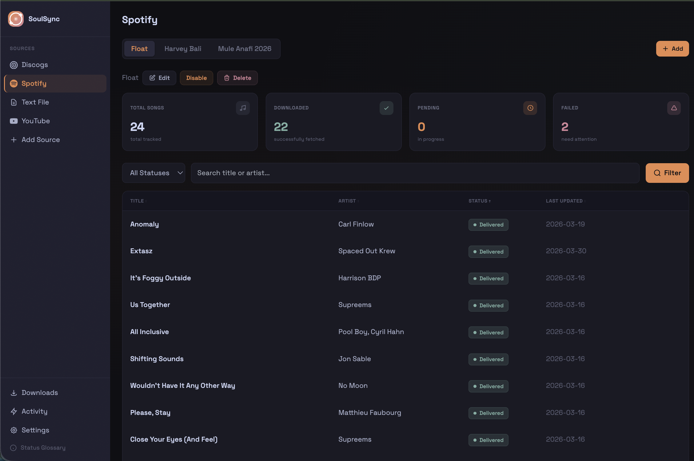
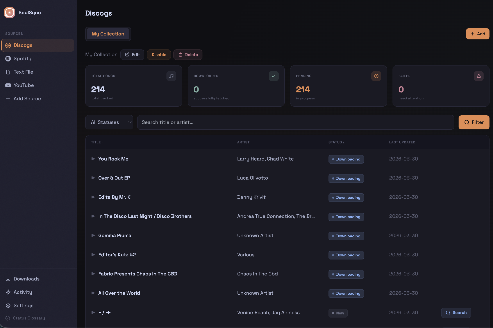
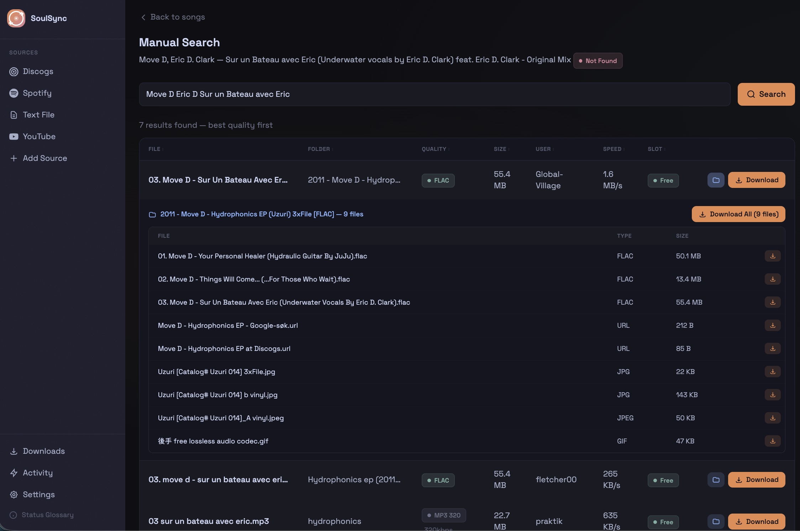
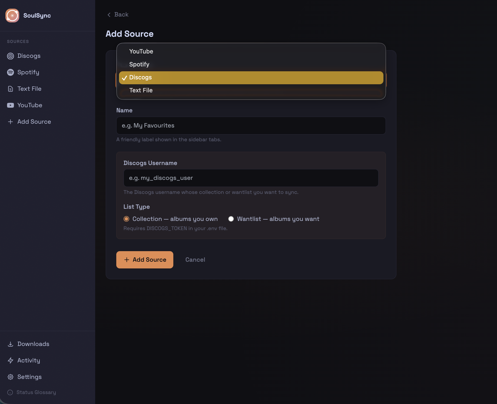

# SoulSync

Automatically sync music from your playlists and collections to your computer via the Soulseek P2P network.

Point it at your YouTube playlists, Spotify playlists, Discogs collection, or a simple text file of tracks — SoulSync finds, downloads, and delivers the best quality available to your music folder. Runs daily on autopilot with a web dashboard to manage everything.



## Features

- **Multi-source sync** — YouTube playlists, Spotify playlists, Discogs collections/wantlists, plain text files
- **Quality-first downloads** — Prefers FLAC, then lossless, then MP3 320, then any audio. Automatically upgrades MP3s to FLAC when available
- **Album support** — Discogs and text file sources can download full albums, not just individual tracks
- **Smart title parsing** — Uses Claude Haiku to extract artist/title from messy YouTube video titles
- **Daily autopilot** — Runs on a configurable schedule, retries failed searches after a cooldown period
- **Web dashboard** — Add/edit/delete sources, monitor downloads, manually search Soulseek, view activity history
- **Self-hosted** — Runs entirely on your machine via Docker Compose. Your data stays yours

## Quick Start

### Prerequisites

- [Docker Desktop](https://www.docker.com/products/docker-desktop/) installed and running
- A free [Soulseek](https://www.slsknet.org/) account
- An [Anthropic API key](https://console.anthropic.com/) (for Claude Haiku title parsing — costs ~$0.01/month)

### Setup

1. **Clone the repository**

   ```bash
   git clone https://github.com/thanos-cost/soul-sync.git
   cd soul-sync
   ```

2. **Create your environment file**

   ```bash
   cp .env.example .env
   ```

   Edit `.env` and fill in:
   - `SLSK_USERNAME` / `SLSK_PASSWORD` — your Soulseek credentials
   - `SLSKD_API_KEY` — generate one with `openssl rand -base64 32`
   - `DOWNLOAD_DIR` — local staging folder for downloads
   - `SHARE_DIR` — music folder to share with the Soulseek network
   - `DEST_DIR` — final destination for delivered music
   - `SOULSEEK_SYNC_ANTHROPIC_KEY` — your Anthropic API key

3. **Create the slskd config**

   ```bash
   cp data/slskd/slskd.yml.example data/slskd/slskd.yml
   ```

   Open `data/slskd/slskd.yml` and paste the same API key you used for `SLSKD_API_KEY` in `.env` into the `key:` field. This is how the automator authenticates with the Soulseek client. Everything else in the config works out of the box.

4. **Start everything**

   ```bash
   docker compose up -d
   ```

5. **Open the dashboard** at [http://localhost:5001](http://localhost:5001) and add your first source.

The pipeline runs once immediately on startup, then daily at midnight (configurable in the dashboard settings).

## Adding Sources

### YouTube

1. Go to the dashboard and click **+ Add**
2. Select **YouTube** as the source type
3. Paste your playlist URL
4. That's it — no API key needed (uses yt-dlp)

### Spotify

Requires a one-time OAuth setup:

1. Create a free app at [Spotify Developer Dashboard](https://developer.spotify.com/dashboard)
2. In your app settings, add `http://127.0.0.1:8888/callback` as a Redirect URI
3. Under **User Management**, add your Spotify account email
4. Copy the Client ID and Secret into `.env`:
   ```
   SPOTIFY_CLIENT_ID=your_client_id
   SPOTIFY_CLIENT_SECRET=your_client_secret
   ```
5. Restart the containers: `docker compose restart automator`
6. Run the one-time auth flow:
   ```bash
   docker compose exec -it automator python -m sources.spotify_auth
   ```
   This gives you a URL — open it in your browser, log in, agree, and paste the redirect URL back into the terminal.
7. Add your Spotify playlist in the dashboard. The token auto-refreshes from here on.

### Text File

For when your music isn't in a playlist — just type it out:

1. Click **+ Add** and select **Text File**
2. Choose a mode:
   - **Track** — one song per line: `Artist - Title`
   - **Album** — one album per line: `Artist - Album Name`
3. Type or paste your list directly in the dashboard editor

### Discogs

Sync your vinyl collection or wantlist:

1. Generate a personal access token at [Discogs Developer Settings](https://www.discogs.com/settings/developers)
2. Add it to `.env`:
   ```
   DISCOGS_TOKEN=your_token_here
   ```
3. Restart: `docker compose restart automator`
4. In the dashboard, click **+ Add**, select **Discogs**, enter your Discogs username and choose collection or wantlist

## Dashboard

### Sources & Songs

Browse all your sources in the sidebar. Each source shows metric cards (total, downloaded, pending, failed) and a searchable/filterable song table. Click **Search** on any song to manually search Soulseek.



### Downloads

Real-time view of active downloads from Soulseek — see progress, speed, file sizes, and peer names.

### Manual Search

Search Soulseek directly for any song. Results are grouped by quality tier (FLAC > lossless > MP3 320+). You can also browse a peer's folders and download individual files.



### Add Source



## Architecture

```
┌─────────────┐     ┌──────────────┐     ┌──────────────┐
│    slskd     │     │   automator  │     │  dashboard   │
│  (Soulseek   │◄────│  (Python     │     │  (Flask      │
│   client)    │     │   pipeline)  │     │   web UI)    │
│  :50300      │     │              │     │  :5001       │
└─────────────┘     └──────┬───────┘     └──────┬───────┘
                           │                     │
                           ▼                     ▼
                    ┌──────────────────────────────────┐
                    │     /data/songs.db (SQLite)       │
                    └──────────────────────────────────┘
```

Three Docker containers sharing a SQLite database:

- **slskd** — Soulseek client with a REST API. Handles all P2P communication, searches, and file transfers
- **automator** — Python daemon that runs the pipeline on a daily schedule. Fetches songs from sources, searches Soulseek, enqueues downloads, and delivers completed files
- **dashboard** — Flask web UI for managing sources, monitoring downloads, and manual searches

## Pipeline Flow

Each run goes through these stages:

1. **Fetch** — Pull songs from all enabled sources (YouTube, Spotify, Discogs, text files)
2. **Parse** — Extract artist/title using Claude Haiku (YouTube titles need AI help)
3. **Search** — Query Soulseek for each new song, select the best quality match
4. **Download** — Enqueue with slskd, poll for completion
5. **Deliver** — Move completed files to your destination folder, organized by source name
6. **Upgrade** — Check if FLAC versions exist for any MP3 downloads

Failed searches are retried after a 7-day cooldown. Stalled downloads are automatically re-queued from alternative sources.

## Configuration

All configuration lives in `.env`. See [`.env.example`](.env.example) for the full reference with descriptions.

| Variable | Required | Description |
|----------|----------|-------------|
| `SLSK_USERNAME` | Yes | Soulseek account username |
| `SLSK_PASSWORD` | Yes | Soulseek account password |
| `SLSKD_API_KEY` | Yes | API key for slskd (generate with `openssl rand -base64 32`) |
| `DOWNLOAD_DIR` | Yes | Local staging folder for in-progress downloads |
| `SHARE_DIR` | Yes | Music folder shared with the Soulseek network (read-only) |
| `DEST_DIR` | Yes | Destination folder for delivered music |
| `SOULSEEK_SYNC_ANTHROPIC_KEY` | Yes | Anthropic API key for title parsing |
| `SPOTIFY_CLIENT_ID` | No | Spotify app client ID (only if using Spotify sources) |
| `SPOTIFY_CLIENT_SECRET` | No | Spotify app client secret |
| `DISCOGS_TOKEN` | No | Discogs personal access token (only if using Discogs sources) |

### Folder Structure

Delivered files are organized by source name:

```
DEST_DIR/
├── My YouTube Playlist/
│   ├── Artist - Track.flac
│   └── Artist - Track.mp3
├── Jazz Spotify/
│   └── Artist - Track.flac
└── Vinyl Collection/          ← Discogs (albums)
    ├── Miles Davis - Kind of Blue/
    │   ├── 01 - So What.flac
    │   └── 02 - Freddie Freeloader.flac
    └── Coltrane - A Love Supreme/
        └── ...
```

### Sharing Back

Soulseek is a community built on sharing. The `SHARE_DIR` volume makes your music available to other users. For others to download from you, you need to forward port **50300** (TCP) on your router to your machine's local IP.

### Triggering a Run

The pipeline runs daily at a configurable time (default: midnight). To trigger a run immediately:

```bash
docker kill --signal=USR1 automator
```

Or restart the container: `docker compose restart automator`

## Useful Commands

```bash
# Start all containers
docker compose up -d

# View pipeline logs
docker compose logs automator -f

# Trigger immediate pipeline run
docker kill --signal=USR1 automator

# Restart after .env changes
docker compose restart automator

# Open the slskd web UI (Soulseek client)
open http://localhost:5030

# Spotify one-time auth setup
docker compose exec -it automator python -m sources.spotify_auth

# Stop everything
docker compose down
```

## License

[MIT](LICENSE)
